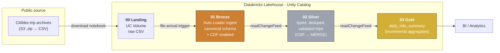
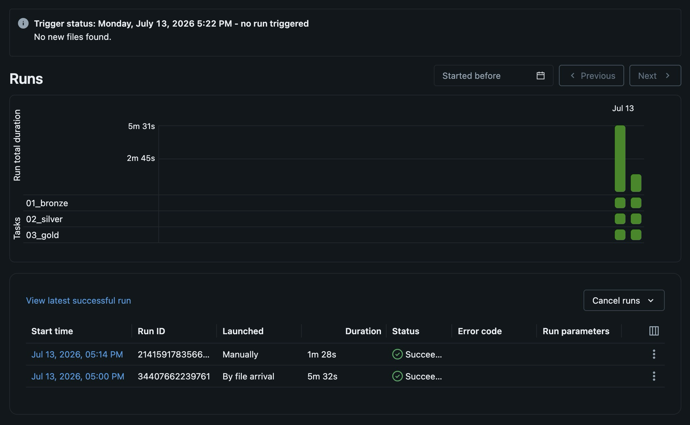

# Citibike Lakehouse — Databricks Medallion Pipeline with CI/CD

An end-to-end **data engineering** project that ingests ~10 years of public
[Citibike](https://citibikenyc.com/system-data) trip data, refines it through a
**Bronze → Silver → Gold medallion architecture** on the Databricks Lakehouse,
and ships it with **Databricks Asset Bundles** and a **GitHub Actions CI/CD**
pipeline across `dev` / `test` / `prod` environments.

<p>
  
  
  
  
  
</p>

---

## What this project demonstrates

| Capability | Where it lives |
|---|---|
| **Medallion architecture** (Landing → Bronze → Silver → Gold) | [`src/notebooks/`](src/notebooks/) |
| **Incremental streaming ingestion** with Auto Loader (`cloudFiles`) | [Bronze notebook](src/notebooks/01_bronze/01_bronze_citibike.ipynb) |
| **Change Data Feed (CDC)** + idempotent `MERGE` upserts | [Silver notebook](src/notebooks/02_silver/02_silver_citibike.ipynb) |
| **Correct incremental aggregates** via affected-partition recompute | [Gold notebook](src/notebooks/03_gold/03_gold_citibike.ipynb) |
| **Schema evolution** across a decade of changing source formats | [`src/shared/canonical.py`](src/shared/canonical.py) |
| **Infrastructure as code** with multi-env Asset Bundles | [`databricks.yml`](databricks.yml), [`resources/`](resources/) |
| **CI/CD**: lint, test, validate, and gated deploys | [`.github/workflows/`](.github/workflows/) |
| **Tested code**: fast unit tests + Spark integration tests | [`tests/`](tests/) |

---

## Architecture



The **Bronze → Silver → Gold** stages run as a single orchestrated job
([`01_medallion_pipeline_job.yml`](resources/01_medallion_pipeline_job.yml))
that is **triggered automatically when new files land** in the source Volume, so
the pipeline is event-driven rather than scheduled.



> Live runs of the orchestrated job. Note the run **launched _by file arrival_**
> (not on a schedule), all three tasks succeeding, and Unity Catalog **lineage**
> tracking 2 upstream and 3 downstream tables.

### Layer responsibilities

| Layer | Table | Key logic |
|---|---|---|
| **Landing** | UC Volume | Probes known Citibike archive URL variants, downloads, extracts the single CSV per month. |
| **Bronze** | `*.01_bronze.citibike_trips` | Auto Loader stream; maps ~4 historical column-naming conventions onto one canonical schema; synthesises a deterministic `ride_id` (SHA-256 of the natural key) for legacy files that lack one; enables Change Data Feed. |
| **Silver** | `*.02_silver.citibike_trips` | Parses multiple timestamp formats, derives `trip_duration_mins` (nulls out impossible >24 h trips), normalises `member_casual`, filters invalid rows, and **upserts** via CDF `MERGE` keeping the latest change per `ride_id`. |
| **Gold** | `*.03_gold.daily_ride_summary` | For each batch, recomputes **only the affected days** in full from Silver → correct `min`/`max`/`avg`/`count` even under late-arriving data and deletes. |

---

## Engineering highlights

- **Idempotent, deterministic IDs.** Early Citibike files predate `ride_id`, so
  the bronze layer hashes the trip's natural key (`started_at` + station ids +
  bike id + duration). Re-processing the same trip yields the same id, which
  keeps the downstream `MERGE` idempotent.
- **Correct incremental gold.** Naively summing CDF deltas breaks `min`/`max`
  and deletes. Instead the gold layer collects the *distinct affected days* in a
  micro-batch and **recomputes those days from live Silver**, so aggregates stay
  exact without a full rebuild.
- **Schema canonicalization is pure and tested.** The column-mapping rules live
  in [`src/shared/canonical.py`](src/shared/canonical.py) as plain Python so they
  can be unit-tested without a Spark cluster; the notebook applies them with
  `coalesce`/`select`.
- **Two-tier testing.** Fast **unit tests** run anywhere (incl. CI); **Spark
  integration tests** are marked and auto-skip when no workspace is configured.

---

## Project structure

```
.
├── databricks.yml                 # Bundle definition: dev / test / prod targets + variables
├── resources/
│   ├── 00_download_trips_data_job.yml     # Landing: download & extract source archives
│   └── 01_medallion_pipeline_job.yml      # Bronze → Silver → Gold (file-arrival triggered)
├── src/
│   ├── notebooks/                 # One notebook per medallion layer
│   │   ├── 00_landing/ 01_bronze/ 02_silver/ 03_gold/
│   └── shared/
│       ├── canonical.py           # Pure, unit-tested column-canonicalization rules
│       ├── utils.py               # Download/extract helpers (pure funcs + I/O wrapper)
│       └── udfs.py                # Reusable Spark column transforms
├── tests/
│   ├── unit/                      # No Spark/network — run in CI
│   └── integration/               # Databricks Connect (Spark) — auto-skipped in CI
├── fixtures/                      # Sample data for tests
└── .github/workflows/             # CI (validate/lint/test) + CD (deploy)
```

---

## CI/CD

Two GitHub Actions workflows implement a promote-through-environments flow:

- **`ci.yml`** — on every pull request: `ruff` lint + format check, `pytest`
  unit tests, and `databricks bundle validate` for each target.
- **`deploy.yml`** — on merge to `main`, deploy to **test**; deploying to
  **prod** is gated behind a manual approval (GitHub Environment) / tag.

Each of `dev` / `test` / `prod` is a **separate Azure Databricks workspace**.
Environment-specific *config* (host, catalog, cluster, volume path) lives in the
[`databricks.yml`](databricks.yml) targets, while environment-specific
*credentials* live in **GitHub Environments** of the same name — each holding its
own workspace's OAuth service-principal `DATABRICKS_CLIENT_ID` /
`DATABRICKS_CLIENT_SECRET`. A job that declares `environment: <target>`
automatically picks up the right secrets (and `prod` can require a manual
approval). No personal tokens live in the repo. See
[`.github/workflows/`](.github/workflows/).

---

## Running it yourself

### Prerequisites
- Python 3.12 and [uv](https://docs.astral.sh/uv/)
- The [Databricks CLI](https://docs.databricks.com/dev-tools/cli/) (`v0.2+`)
- A Databricks workspace with Unity Catalog (for actual deployment)

### Local development

```bash
uv sync --dev            # install dependencies

uv run ruff check .      # lint
uv run ruff format .     # format
uv run pytest            # unit tests (integration tests skip without a workspace)
uv run pytest -m integration   # run Spark tests against a configured workspace
```

### Deploy

```bash
databricks bundle validate -t dev
databricks bundle deploy   -t dev
databricks bundle run citibike_medallion_job -t dev
```

`dev` deploys an isolated, user-prefixed copy with triggers paused; `test` /
`prod` deploy production-mode copies. Set each target's `cluster_id` and
`source_volume_path` in [`databricks.yml`](databricks.yml).

---

## Possible extensions

- Add data-quality expectations (Lakeflow Declarative Pipelines / DLT or
  Great Expectations) between layers.
- Swap the all-purpose cluster for **serverless** or job clusters.
- Publish the gold table to a dashboard (trips/day, member vs casual, station
  flows).

---

## License

[MIT](LICENSE) · Built by Jack Toke as a data-engineering portfolio project.
Citibike data © Lyft, used under the
[Citibike Data License Agreement](https://citibikenyc.com/data-sharing-policy).
